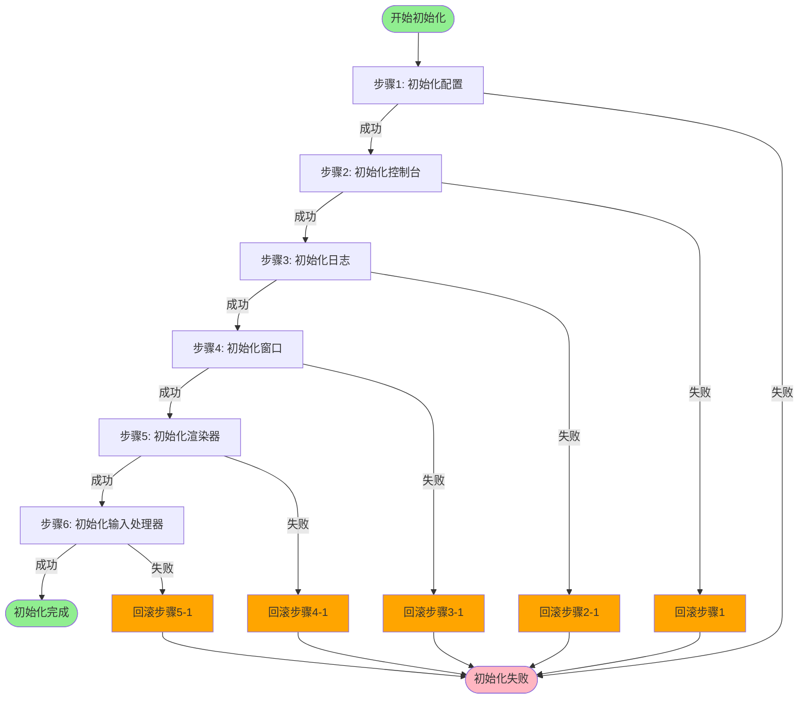
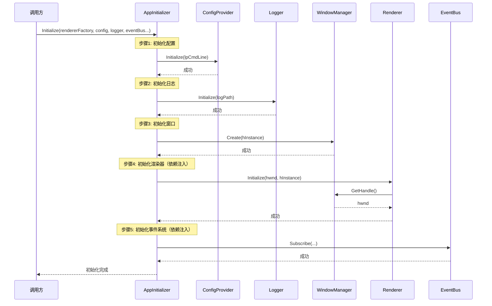
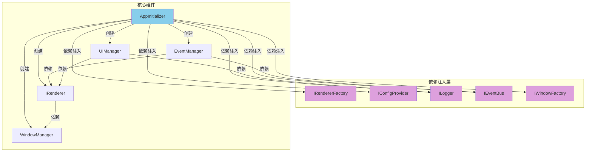
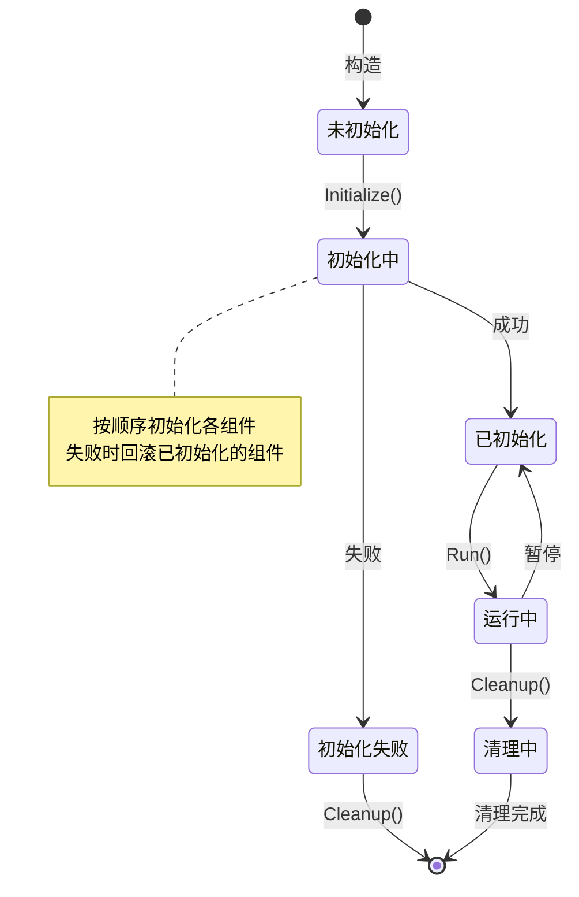
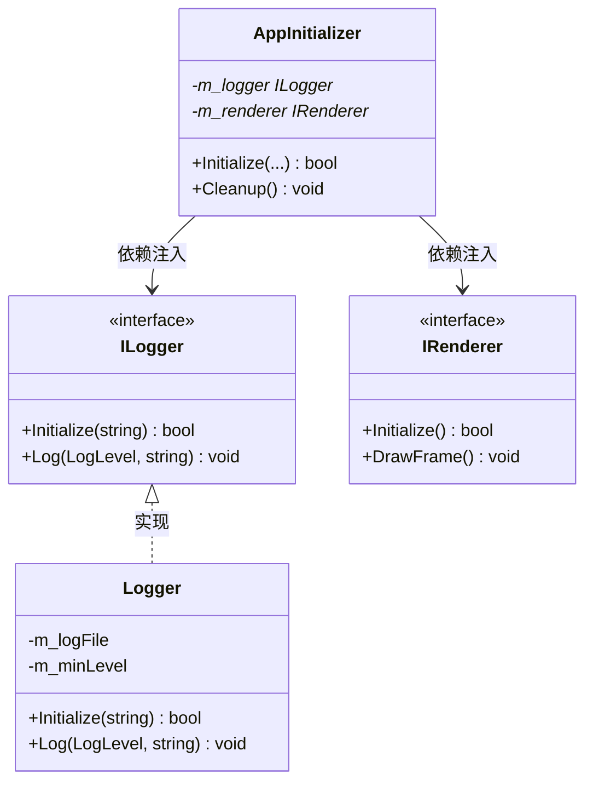

# 项目开发标准

## 一、文件组织规范

### 1.1 目录结构
```
renderer/
├── core/              # 核心模块
│   ├── interfaces/    # 接口定义（所有接口以 I 开头）
│   ├── managers/      # 管理器类
│   ├── utils/         # 工具类
│   ├── config/        # 配置和常量
│   ├── factories/     # 工厂类
│   └── handlers/      # 处理器类
├── vulkan/            # Vulkan 渲染器实现
├── window/            # 窗口管理
├── shader/            # Shader 相关
├── ui/                # UI 组件
└── ...                # 其他功能模块
```

### 1.2 文件命名
- **头文件**：使用 `.h` 扩展名，采用 snake_case 或 lowercase
- **实现文件**：使用 `.cpp` 扩展名，与头文件同名
- **接口文件**：必须放在 `core/interfaces/` 目录，以 `i` 开头（如 `irenderer.h`）

## 二、代码风格规范

### 2.1 头文件保护
所有头文件必须使用 `#pragma once`：
```cpp
#pragma once
// 文件内容
```

### 2.2 Include 顺序
Include 顺序必须遵循以下规则：
1. 当前文件的对应头文件（.cpp 文件）
2. 系统头文件（`<windows.h>`, `<string>` 等）
3. 第三方库头文件（`<vulkan/vulkan.h>` 等）
4. 项目头文件（按依赖层级从内到外）

示例：
```cpp
#include "vulkan/vulkan_renderer.h"  // 1. 对应头文件（.cpp 文件）
#include <windows.h>                  // 2. 系统头文件
#include <vulkan/vulkan.h>            // 3. 第三方库
#include "core/interfaces/irenderer.h" // 4. 项目头文件（接口）
#include "core/config/constants.h"    // 4. 项目头文件（配置）
```

### 2.3 前向声明
优先使用前向声明，减少头文件依赖：
```cpp
// 前向声明
class IRenderer;
class IEventBus;
class Window;

// 在头文件中使用前向声明，而不是包含完整定义
class SomeClass {
    IRenderer* m_renderer;  // 指针可以使用前向声明
};
```

## 三、命名规范

### 3.1 类命名
- **接口类**：以 `I` 开头，PascalCase（如 `IRenderer`, `IEventBus`）
- **普通类**：PascalCase（如 `Window`, `EventManager`）
- **工厂类**：以 `Factory` 结尾（如 `VulkanRendererFactory`）
- **管理器类**：以 `Manager` 结尾（如 `WindowManager`, `EventManager`）
- **禁止缩写**：必须使用完整单词（如 `Renderer` 而非 `Rdr`，`Manager` 而非 `Mgr`，`Factory` 而非 `Fact`）

### 3.2 成员变量
- **成员变量**：必须以 `m_` 前缀，camelCase（如 `m_renderer`, `m_initialized`）
- **静态成员**：必须以 `s_` 前缀（如 `s_instance`）
- **常量**：全大写，下划线分隔（如 `MAX_BUFFER_SIZE`）

### 3.3 方法命名
- **公共方法**：PascalCase（如 `Initialize()`, `GetHandle()`）
- **私有方法**：PascalCase（如 `CreateInstance()`, `HandleMessage()`）
- **Getter 方法**：`Get` + 属性名，const 方法（如 `GetHandle() const`）
- **Setter 方法**：`Set` + 属性名（如 `SetEventBus()`）
- **布尔查询方法**：`Is`/`Has` + 属性名（如 `IsRunning()`, `HasTexture()`）

### 3.4 参数命名
- 使用有意义的名称，camelCase（如 `hInstance`, `rendererFactory`）
- 指针参数明确所有权（不拥有所有权时使用原始指针，拥有时使用 `std::unique_ptr`）
- **禁止缩写**：必须使用完整单词（如 `renderer` 而非 `rdr`，`factory` 而非 `fact`，`manager` 而非 `mgr`）

### 3.5 命名通用原则
- **所有命名（类、方法、变量、参数）均禁止使用缩写**
- 使用完整、有意义的单词组合
- 例外：Windows API 约定的缩写（如 `HWND`, `HINSTANCE`）可以保留

## 四、架构设计规范

### 4.1 接口设计
- 所有接口必须放在 `core/interfaces/` 目录
- 接口类名以 `I` 开头
- 接口必须包含虚析构函数：`virtual ~InterfaceName() = default;`
- 所有方法必须是纯虚函数（`= 0`），除非有默认实现

示例：
```cpp
// core/interfaces/irenderer.h
class IRenderer {
public:
    virtual ~IRenderer() = default;
    virtual bool Initialize(HWND hwnd, HINSTANCE hInstance) = 0;
    virtual void Cleanup() = 0;
};
```

### 4.2 依赖注入
- **禁止使用全局单例**
- 所有依赖通过构造函数或初始化方法注入
- 使用接口类型而非具体类型作为参数和成员

示例：
```cpp
class SomeManager {
public:
    void Initialize(IRenderer* renderer, ILogger* logger);  // 依赖注入
    
private:
    IRenderer* m_renderer = nullptr;  // 接口类型
    ILogger* m_logger = nullptr;
};
```

### 4.2.1 复杂依赖注入文档要求
对于依赖超过 3 个的复杂初始化方法，必须在头文件注释或独立文档中提供：
1. **初始化流程图**：展示初始化步骤和依赖顺序
2. **时序图**：展示各组件初始化的时序关系
3. **依赖关系图**：清晰标注所有依赖项及其关系
4. **使用示例**：提供完整的调用示例代码

**示例场景**：`AppInitializer::Initialize()` 依赖 8 个参数，必须提供流程图说明初始化顺序。

**流程图格式要求**：
- 使用 Mermaid 语法或 ASCII 图表
- 标注每个初始化步骤的依赖关系
- 明确错误处理和回滚路径

**时序图格式要求**：
- 展示调用方、初始化器、被注入组件的交互
- 标注依赖注入的顺序
- 标注可能失败的点

示例流程图格式：
```markdown
## AppInitializer 初始化流程

```
1. InitializeConfig()        [无依赖]
   ↓
2. InitializeConsole()       [依赖: Config]
   ↓
3. InitializeLogger()        [依赖: Config]
   ↓
4. InitializeWindow()        [依赖: Logger]
   ↓
5. InitializeRenderer()      [依赖: Window, Logger]
   ↓
6. InitializeInputHandler()  [依赖: Logger, EventBus]
   ↓
7. InitializeManagers()      [依赖: Renderer, Window]
   ↓
8. InitializeUI()            [依赖: Renderer, Window, Logger]
   ↓
9. InitializeEventSystem()   [依赖: InputHandler, UIManager, Renderer]
   ↓
10. InitializeRenderScheduler() [依赖: Renderer, EventManager]
```
```

### 4.3 资源管理
- 使用 `std::unique_ptr` 管理独占所有权的资源
- 使用 `std::shared_ptr` 管理共享所有权的资源（谨慎使用）
- 原始指针用于不拥有所有权的引用（如通过接口注入的依赖）
- 析构函数中必须清理所有资源

示例：
```cpp
class SomeClass {
private:
    std::unique_ptr<WindowManager> m_windowManager;  // 拥有所有权
    IRenderer* m_renderer = nullptr;  // 不拥有所有权，由外部管理
};
```

### 4.5 性能优化例外规则
- **高频渲染对象例外**：对于高频创建/销毁的渲染对象（如 `Buffer`、`Texture`、`CommandBuffer`），允许以下例外：
  1. **可跳过接口层**：允许直接使用具体实现类（如 `VulkanBuffer`、`VulkanTexture`），避免虚函数调用开销
  2. **使用池化分配器**：必须使用对象池或内存池管理，禁止使用 `std::unique_ptr` 进行堆分配
  3. **明确标注**：必须在类注释中明确标注"性能优化例外：直接使用实现类"
  4. **限制范围**：仅限渲染管线内的核心对象，不适用于管理器、工具类等

示例：
```cpp
// 性能优化例外：直接使用 VulkanBuffer 而非接口，使用对象池管理
class RenderCommand {
private:
    VulkanBuffer* m_vertexBuffer;  // 从对象池获取，不拥有所有权
    VulkanTexture* m_texture;      // 从对象池获取，不拥有所有权
};
```

### 4.4 初始化规范
- 所有可初始化的类必须提供 `Initialize()` 方法
- 初始化方法返回 `bool` 或 `InitializationResult`
- 必须提供对应的 `Cleanup()` 方法
- 初始化必须支持多次调用检查（通过 `m_initialized` 标志）

示例：
```cpp
class SomeClass {
public:
    bool Initialize(/* 参数 */);
    void Cleanup();
    
private:
    bool m_initialized = false;
};
```

### 4.4.1 复杂初始化文档要求
对于初始化步骤超过 5 步或依赖关系复杂的类，必须在类注释中提供：
1. **初始化步骤列表**：按顺序列出所有初始化步骤
2. **依赖关系说明**：明确每个步骤依赖哪些前置步骤
3. **错误处理说明**：失败时的回滚机制
4. **调用示例**：提供完整的初始化代码示例

**必须提供流程图的情况**：
- 初始化参数超过 5 个
- 初始化步骤超过 5 步
- 存在循环依赖或复杂依赖关系
- 初始化顺序对结果有重要影响

**文档位置**：
- 简单情况：在类头文件注释中说明
- 复杂情况：在类头文件注释中简要说明，并提供指向详细文档的链接

## 五、注释规范

### 5.1 注释原则
- **只允许解释性注释**：注释用于解释"为什么"和"是什么"，帮助理解代码意图和设计决策
- **禁止事件性注释**：禁止记录"做了什么"、"何时修改"等事件性信息（应使用版本控制系统）
- **禁止冗余注释**：代码已清晰表达意图时不需要注释

### 5.2 类注释
每个类必须有简要注释说明其职责和设计意图：
```cpp
// 事件管理器 - 统一处理所有窗口消息和输入事件
// 通过接口和事件总线解耦，避免直接依赖具体类
class EventManager {
    // ...
};

// 性能优化例外：直接使用 VulkanBuffer 而非接口，使用对象池管理
// 原因：高频创建/销毁，避免虚函数调用和堆分配开销
class RenderCommand {
    // ...
};
```

**复杂类的注释要求**：
对于依赖超过 3 个或初始化步骤超过 5 步的类，必须在注释中说明：
```cpp
// 应用初始化器 - 管理初始化顺序和依赖关系
// 初始化顺序：Config → Console → Logger → Window → Renderer → Input → Managers → UI → Event → Scheduler
// 依赖注入：需注入 8 个参数（RendererFactory, ConfigProvider, Logger, EventBus, WindowFactory, TextRendererFactory等）
// 详见：docs/app_initializer_flow.md（包含完整流程图和时序图）
class AppInitializer {
    // ...
};
```

### 5.3 方法注释
公共方法必须注释说明其功能、设计意图、参数和返回值：
```cpp
// 初始化所有组件（按正确顺序）
// 使用依赖注入：所有组件必须通过参数传入，支持测试和替换
// 返回值：成功返回 true，失败返回 false
bool Initialize(IRendererFactory* rendererFactory, HINSTANCE hInstance);
```

### 5.4 成员变量注释
复杂的成员变量需要注释说明其用途和设计意图：
```cpp
private:
    IRenderer* m_renderer = nullptr;  // 渲染器接口（不拥有所有权，由外部管理生命周期）
    std::unique_ptr<WindowManager> m_windowManager;  // 窗口管理器（拥有所有权）
    bool m_initialized = false;  // 初始化状态标志，防止重复初始化
```

### 5.5 禁止的注释类型
以下类型的注释严格禁止：
- ❌ `// 2024-01-01 修改了XXX`（事件性注释，应使用 Git）
- ❌ `// 添加了错误处理`（事件性注释）
- ❌ `// TODO: 需要优化`（应使用 Issue 跟踪系统）
- ❌ `// FIXME: 临时修复`（应修复而非注释）
- ❌ `// 调用 Initialize 方法`（冗余注释，代码已表达）
- ✅ `// 使用对象池避免高频分配开销`（解释性注释，说明设计意图）

## 六、错误处理规范

### 6.1 返回值规范
- 初始化方法：返回 `bool`（true=成功，false=失败）
- 操作方法：返回 `bool` 或使用 `InitializationResult` 结构
- Getter 方法：直接返回值或引用
- 无返回值方法：`void`

### 6.2 初始化结果
使用 `InitializationResult` 结构体提供详细错误信息：
```cpp
struct InitializationResult {
    bool success;
    std::string errorMessage;
    
    static InitializationResult Success() { return {true, ""}; }
    static InitializationResult Failure(const std::string& msg) { return {false, msg}; }
};
```

### 6.3 错误检查
- 所有可能失败的操作必须检查返回值
- 初始化失败必须能够回滚已初始化的部分
- 使用 `CleanupPartial()` 方法支持部分清理

## 七、常量定义规范

### 7.1 枚举命名
- 枚举类型名：PascalCase（如 `EventType`, `StretchMode`）
- 枚举值：PascalCase（如 `EventType::ButtonClicked`）

### 7.2 常量定义位置
- 模块级常量：放在 `core/config/constants.h`
- 类级常量：作为类的静态常量成员
- 局部常量：在作用域内定义

## 八、事件系统规范

### 8.1 事件定义
- 事件类型使用枚举：`enum class EventType`
- 事件数据使用结构体继承自 `Event` 基类
- 所有事件定义在 `core/interfaces/ievent_bus.h` 或相关事件头文件

### 8.2 事件通信
- 组件间通信必须通过 `IEventBus` 接口
- 禁止直接调用其他组件的方法（除非是接口定义的方法）
- 使用 `Subscribe()` 订阅事件，使用 `Publish()` 发布事件

### 8.3 事件系统使用限制
- **禁止滥用事件系统**：仅在以下场景使用事件总线
  1. 一对多通信（一个发送者，多个接收者）
  2. 组件间解耦通信（发送者不需要知道接收者）
  3. 跨层通信（不同架构层的组件通信）
- **禁止使用事件的场景**：
  1. 简单的一对一调用应使用接口方法调用
  2. 同步返回值操作必须使用接口方法（事件无法返回值）
  3. 需要保证执行顺序的链式操作应使用接口方法
  4. 高频调用的操作应使用直接接口调用（避免事件系统开销）
- **事件命名规范**：
  - 事件类型名应清晰描述发生了什么（如 `ButtonClicked` 而非 `ButtonEvent`）
  - 事件应该表示"发生了什么"而非"要做什么"
- **订阅管理**：
  - 必须在组件 `Cleanup()` 时取消所有订阅
  - 避免在析构函数中发布事件（可能导致悬空指针）
  - 订阅数量应控制在合理范围（单个事件类型不超过 10 个订阅者）

### 8.4 请求-响应事件模式
- **允许场景**：异步请求-响应模式（如 `RequestDataEvent` + `DataResponseEvent`）
- **明确标注**：必须在事件定义和文档中明确标注为"异步请求"
- **配对使用**：请求事件和响应事件必须成对定义，在注释中关联

示例：
```cpp
// 异步请求：数据请求事件（必须与 DataResponseEvent 配对使用）
struct RequestDataEvent : public Event {
    std::string requestId;  // 请求ID，用于匹配响应
    std::string dataType;
    RequestDataEvent(const std::string& id, const std::string& type) 
        : Event(EventType::RequestData), requestId(id), dataType(type) {}
};

// 异步响应：数据响应事件（对应 RequestDataEvent）
struct DataResponseEvent : public Event {
    std::string requestId;  // 匹配对应的请求ID
    std::string data;
    bool success;
    DataResponseEvent(const std::string& id, const std::string& d, bool s) 
        : Event(EventType::DataResponse), requestId(id), data(d), success(s) {}
};
```

**使用要求**：
- 必须在订阅响应事件时验证 `requestId` 匹配
- 必须设置超时机制，避免请求丢失导致的内存泄漏
- 必须在类注释中明确标注使用了异步请求模式

## 九、工厂模式规范

### 9.1 工厂接口
- 所有工厂必须实现对应的接口（如 `IRendererFactory`）
- 工厂接口定义在 `core/interfaces/` 目录
- 工厂实现放在 `core/factories/` 目录

### 9.2 工厂方法
- **返回值类型**：优先使用 `std::unique_ptr` 表示所有权转移
- **接口指针返回限制**：返回 `IInterface*` 极易出错，严格限制使用：
  - **优先使用对象池+句柄模式**：返回句柄（如 `BufferHandle`）而非裸指针（`VulkanBuffer*`）
  - **强制注释所有权**：必须使用 `[[ownership(...)]]` 属性或详细注释明确所有权
  - **禁止默认允许**：仅在特殊场景下使用，必须说明理由
- 工厂方法命名：`Create` + 产品名（如 `CreateRenderer()`）

示例：
```cpp
// 推荐方案1：返回 unique_ptr，所有权明确
class IRendererFactory {
public:
    virtual std::unique_ptr<IRenderer> CreateRenderer() = 0;  // 调用方获得所有权
};

// 推荐方案2：返回句柄，通过对象池管理（避免裸指针）
using BufferHandle = uint32_t;
class IBufferFactory {
public:
    // 返回句柄，通过对象池管理，避免所有权问题
    virtual BufferHandle CreateBuffer(const BufferDesc& desc) = 0;
    virtual void DestroyBuffer(BufferHandle handle) = 0;
};

// 不推荐：返回裸指针，必须强制注释所有权
class IWindowFactory {
public:
    // 返回窗口指针
    // 所有权：[TRANSFER] 调用方获得所有权，负责销毁
    // 或
    // 所有权：[BORROW] 调用方不拥有所有权，由工厂管理
    // 建议：改用 WindowHandle + 对象池模式
    [[ownership("transfer")]]  // 强制标注所有权语义
    virtual IWindow* CreateWindow() = 0;
};
```

### 9.3 对象池+句柄模式
- **推荐模式**：对于高频创建/销毁的对象，使用对象池+句柄替代裸指针
- **句柄类型**：使用整数类型（如 `uint32_t`）作为句柄，支持验证和重用
- **所有权明确**：句柄的所有权通过对象池管理，避免内存泄漏和悬空指针

示例：
```cpp
// 句柄定义
using BufferHandle = uint32_t;
constexpr BufferHandle INVALID_BUFFER_HANDLE = 0;

// 对象池管理
class BufferPool {
public:
    BufferHandle Create(const BufferDesc& desc);
    void Destroy(BufferHandle handle);
    VulkanBuffer* Get(BufferHandle handle);  // 内部使用，外部不暴露
    bool IsValid(BufferHandle handle) const;
};

// 工厂使用对象池
class VulkanBufferFactory : public IBufferFactory {
public:
    BufferHandle CreateBuffer(const BufferDesc& desc) override {
        return m_bufferPool->Create(desc);  // 返回句柄
    }
    
    void DestroyBuffer(BufferHandle handle) override {
        m_bufferPool->Destroy(handle);
    }
    
private:
    std::unique_ptr<BufferPool> m_bufferPool;
};
```

**所有权标注格式**：
- `[[ownership("transfer")]]`：调用方获得所有权
- `[[ownership("borrow")]]`：调用方不拥有所有权，由工厂管理
- 必须同时在注释中说明所有权语义

## 十一、实体组件系统（ECS）规范

### 11.1 核心设计原则
- **实体（Entity）**：轻量句柄，不包含任何数据或逻辑
- **组件（Component）**：纯数据，无方法
- **系统（System）**：纯逻辑，操作组件数据

### 11.2 实体规范
- **实体必须是轻量句柄**：使用整数类型（如 `uint32_t`），禁止使用裸指针或对象
- **实体ID生成**：必须使用专门的实体ID生成器，支持重用和验证
- **实体生命周期**：实体的创建和销毁必须通过实体管理器

示例：
```cpp
// 实体类型定义
using Entity = uint32_t;
constexpr Entity INVALID_ENTITY = 0;

// 实体管理器
class EntityManager {
public:
    Entity CreateEntity();
    void DestroyEntity(Entity entity);
    bool IsValid(Entity entity) const;
};
```

### 11.3 组件规范
- **组件必须是POD类型**：Plain Old Data，平凡可复制类型
- **支持SIMD批量操作**：组件布局必须对齐，支持SIMD指令批量处理
- **组件位置**：组件必须存储在连续内存中（SoA结构）
- **禁止虚函数**：组件不能有虚函数表，保证POD特性

示例：
```cpp
// 位置组件（POD类型，支持SIMD）
struct PositionComponent {
    alignas(16) float x, y, z;  // 16字节对齐，支持SIMD
};

// 速度组件（POD类型）
struct VelocityComponent {
    alignas(16) float vx, vy, vz;
};

// 禁止：包含虚函数的组件
// struct BadComponent {
//     virtual ~BadComponent() {}  // ❌ 禁止
// };
```

### 11.4 系统规范
- **系统必须按依赖拓扑排序**：如 `PhysicsSystem` → `RenderSystem`
- **系统间通信**：通过事件总线，禁止系统间直接调用
- **系统执行顺序**：必须在系统注册时声明依赖关系，由系统管理器自动排序
- **批量处理**：系统必须支持批量处理同一类型的组件

示例：
```cpp
// 物理系统（必须在渲染系统之前执行）
class PhysicsSystem : public ISystem {
public:
    void Update(float deltaTime, ComponentStorage& storage) override;
    
    // 声明依赖关系
    SystemDependencies GetDependencies() const override {
        return {};  // 无依赖
    }
};

// 渲染系统（依赖物理系统）
class RenderSystem : public ISystem {
public:
    void Update(float deltaTime, ComponentStorage& storage) override;
    
    SystemDependencies GetDependencies() const override {
        return {SystemType::Physics};  // 依赖物理系统
    }
};
```

### 11.5 组件存储规范
- **SoA结构**：Structure of Arrays，而非Array of Structures
- **连续内存**：同一类型的组件存储在连续内存中，提高缓存命中率
- **组件查询**：通过实体ID快速查找组件

示例：
```cpp
// 组件存储（SoA结构）
class ComponentStorage {
public:
    template<typename Component>
    Component* GetComponent(Entity entity);
    
    template<typename Component>
    void AddComponent(Entity entity, const Component& component);
    
private:
    std::unordered_map<Entity, uint32_t> m_entityToIndex;  // 实体到索引映射
    std::vector<PositionComponent> m_positions;  // 位置组件数组（连续内存）
    std::vector<VelocityComponent> m_velocities;  // 速度组件数组（连续内存）
};
```

## 十二、游戏循环（Game Loop）规范

### 12.1 核心要求
- **必须支持固定时间步+可变渲染插值**：逻辑更新使用固定时间步，渲染使用可变时间步插值
- **禁止在Update()中修改渲染状态**：应写入RenderCommand缓冲区，延迟到渲染阶段执行
- **时间管理**：必须提供准确的时间步长计算和累积

### 12.2 固定时间步规范
- **逻辑时间步**：固定时间步长（如 1/60秒 或 1/120秒）
- **时间累积**：使用累积器处理帧时间变化，确保逻辑更新频率稳定
- **时间插值**：为渲染提供插值因子，实现平滑渲染

示例：
```cpp
class GameLoop {
private:
    static constexpr float FIXED_DELTA_TIME = 1.0f / 60.0f;  // 固定时间步（60Hz）
    float m_accumulator = 0.0f;
    float m_alpha = 0.0f;  // 插值因子（0.0 - 1.0）
    
public:
    void Run() {
        float deltaTime = GetDeltaTime();  // 可变帧时间
        m_accumulator += deltaTime;
        
        // 固定时间步更新
        while (m_accumulator >= FIXED_DELTA_TIME) {
            Update(FIXED_DELTA_TIME);  // 逻辑更新
            m_accumulator -= FIXED_DELTA_TIME;
        }
        
        // 计算插值因子
        m_alpha = m_accumulator / FIXED_DELTA_TIME;
        
        // 可变时间步渲染（带插值）
        Render(m_alpha);
    }
};
```

### 12.3 Update()方法规范
- **禁止修改渲染状态**：Update()方法中禁止直接修改渲染相关的状态
- **使用命令缓冲**：需要修改渲染状态时，应写入RenderCommand缓冲区
- **纯逻辑处理**：Update()只处理游戏逻辑、物理、AI等

示例：
```cpp
// 正确：写入命令缓冲区
void SomeSystem::Update(float deltaTime) {
    // 逻辑更新
    entity.position += entity.velocity * deltaTime;
    
    // 渲染命令写入缓冲区（延迟执行）
    m_renderCommandBuffer->AddCommand(
        RenderCommand::UpdateTransform(entity.id, entity.position)
    );
}

// 错误：直接修改渲染状态
void BadSystem::Update(float deltaTime) {
    m_renderer->SetTransform(entity.position);  // ❌ 禁止
}
```

### 12.4 渲染命令缓冲规范
- **命令缓冲接口**：提供统一的命令缓冲接口
- **延迟执行**：所有渲染命令在Render()阶段统一执行
- **命令批处理**：支持命令合并和批处理优化

示例：
```cpp
class RenderCommandBuffer {
public:
    void AddCommand(const RenderCommand& command);
    void Clear();
    void Execute(IRenderer* renderer);  // 统一执行所有命令
};

enum class RenderCommandType {
    UpdateTransform,
    SetMaterial,
    DrawMesh,
    // ...
};
```

## 十三、物理引擎抽象规范

### 13.1 核心要求
- **物理步长必须与渲染解耦**：物理更新使用固定时间步，独立于渲染帧率
- **碰撞层必须支持位掩码**：使用位掩码实现多层次的碰撞过滤
- **禁止在物理回调中直接修改ECS组件**：应写入DeferredCommand，延迟执行

### 13.2 物理步长规范
- **固定物理时间步**：物理更新必须使用固定时间步（如 60Hz 或 120Hz）
- **独立于渲染**：物理更新频率与渲染帧率完全解耦
- **子步长支持**：复杂场景支持多子步长以提高精度

示例：
```cpp
class PhysicsEngine {
private:
    static constexpr float PHYSICS_DELTA_TIME = 1.0f / 60.0f;  // 固定60Hz
    float m_physicsAccumulator = 0.0f;
    
public:
    void Update(float deltaTime) {
        m_physicsAccumulator += deltaTime;
        
        // 固定物理时间步
        while (m_physicsAccumulator >= PHYSICS_DELTA_TIME) {
            StepPhysics(PHYSICS_DELTA_TIME);
            m_physicsAccumulator -= PHYSICS_DELTA_TIME;
        }
    }
};
```

### 13.3 碰撞层规范
- **位掩码实现**：使用位掩码（如 `uint32_t`）表示碰撞层
- **多层支持**：支持多个碰撞层同时生效
- **层过滤**：提供层过滤机制，控制哪些层可以碰撞

示例：
```cpp
// 碰撞层定义
namespace CollisionLayer {
    constexpr uint32_t NONE = 0x0000;
    constexpr uint32_t STATIC = 0x0001;      // 静态物体
    constexpr uint32_t DYNAMIC = 0x0002;     // 动态物体
    constexpr uint32_t PLAYER = 0x0004;      // 玩家
    constexpr uint32_t ENEMY = 0x0008;       // 敌人
    constexpr uint32_t PROJECTILE = 0x0010;  // 投射物
    constexpr uint32_t TRIGGER = 0x0020;     // 触发器
}

// 碰撞体配置
struct CollisionBody {
    uint32_t layerMask = CollisionLayer::DYNAMIC;  // 所属层
    uint32_t collisionMask = CollisionLayer::STATIC | CollisionLayer::ENEMY;  // 可碰撞的层
};
```

### 13.4 物理回调规范
- **禁止直接修改ECS组件**：物理回调中禁止直接修改ECS组件状态
- **使用延迟命令**：需要修改组件时，写入DeferredCommand缓冲区
- **回调类型**：支持碰撞开始、持续、结束等回调

示例：
```cpp
// 物理回调接口
class IPhysicsCallback {
public:
    // 碰撞开始回调
    virtual void OnCollisionStart(Entity entity1, Entity entity2, const CollisionInfo& info) {
        // 禁止：直接修改ECS组件
        // m_componentStorage->GetComponent<HealthComponent>(entity1)->hp -= 10;  // ❌
        
        // 正确：写入延迟命令
        m_deferredCommands->AddCommand(
            DeferredCommand::ModifyComponent(entity1, HealthComponent{hp: -10})
        );
    }
};
```

### 13.5 延迟命令缓冲规范
- **延迟执行**：所有ECS组件修改命令在物理更新完成后统一执行
- **命令类型**：支持添加、修改、删除组件等操作
- **执行顺序**：延迟命令在物理更新后、逻辑更新前执行
- **缓冲区大小限制**：必须限制缓冲区最大容量，防止帧率不稳导致命令堆积
- **超时机制**：命令超过一定时间未执行应丢弃或报警
- **统计功能**：提供命令执行统计，便于监控和调试

示例：
```cpp
struct DeferredCommandStats {
    size_t commandsAdded = 0;      // 添加的命令数
    size_t commandsExecuted = 0;   // 执行的命令数
    size_t commandsDropped = 0;    // 丢弃的命令数（超时）
    size_t maxBufferSize = 0;      // 历史最大缓冲区大小
    float averageExecutionTime = 0.0f;  // 平均执行时间
};

class DeferredCommandBuffer {
public:
    // 配置
    void SetMaxBufferSize(size_t maxSize) { m_maxBufferSize = maxSize; }
    void SetCommandTimeout(float timeoutSeconds) { m_commandTimeout = timeoutSeconds; }
    
    // 添加命令（可能失败，如果缓冲区已满）
    bool AddCommand(const DeferredCommand& command);
    
    // 执行所有命令
    void Execute(ComponentStorage& storage);
    
    // 清理超时命令
    void CleanupExpiredCommands(float currentTime);
    
    // 统计信息
    const DeferredCommandStats& GetStats() const { return m_stats; }
    void ResetStats() { m_stats = {}; }
    
    void Clear();
    
    // 检查缓冲区状态
    size_t GetCurrentSize() const { return m_commands.size(); }
    bool IsFull() const { return m_commands.size() >= m_maxBufferSize; }
    
private:
    struct TimedCommand {
        DeferredCommand command;
        float timestamp;  // 添加时间
    };
    
    std::vector<TimedCommand> m_commands;
    size_t m_maxBufferSize = 1000;  // 默认最大1000个命令
    float m_commandTimeout = 0.1f;  // 默认100ms超时
    float m_currentTime = 0.0f;
    DeferredCommandStats m_stats;
};

// 使用示例
void PhysicsCallback::OnCollisionStart(...) {
    auto* cmdBuffer = GetDeferredCommandBuffer();
    
    // 检查缓冲区是否已满
    if (cmdBuffer->IsFull()) {
        // 报警或丢弃最旧的命令
        Logger::GetInstance().Warning("DeferredCommandBuffer is full, dropping oldest command");
        cmdBuffer->CleanupExpiredCommands(GetCurrentTime());
    }
    
    // 添加命令
    if (!cmdBuffer->AddCommand(DeferredCommand::ModifyComponent(...))) {
        Logger::GetInstance().Error("Failed to add deferred command");
        return;
    }
}

// 在主循环中
void GameLoop::Update(float deltaTime) {
    // 物理更新
    m_physicsEngine->Update(deltaTime);
    
    // 清理超时命令
    m_deferredCommandBuffer->CleanupExpiredCommands(m_totalTime);
    
    // 执行延迟命令
    m_deferredCommandBuffer->Execute(m_componentStorage);
    
    // 定期输出统计信息
    static float statsTimer = 0.0f;
    statsTimer += deltaTime;
    if (statsTimer >= 5.0f) {
        auto stats = m_deferredCommandBuffer->GetStats();
        Logger::GetInstance().Info(
            "DeferredCommandBuffer Stats: Added={}, Executed={}, Dropped={}, MaxSize={}",
            stats.commandsAdded, stats.commandsExecuted, stats.commandsDropped, stats.maxBufferSize
        );
        statsTimer = 0.0f;
    }
}
```

**缓冲区大小限制规范**：
- 默认最大容量：1000 个命令（可配置）
- 缓冲区满时策略：丢弃最旧的命令或报警
- 监控机制：记录历史最大缓冲区大小

**超时机制规范**：
- 默认超时时间：100ms（可配置）
- 超时处理：定期清理超时命令，记录丢弃统计
- 报警机制：超时命令过多时输出警告

**统计功能规范**：
- 必须提供 `GetStats()` 方法返回统计信息
- 统计信息包括：添加数、执行数、丢弃数、最大缓冲区大小、平均执行时间
- 支持定期输出统计信息用于监控

## 十四、脚本系统规范

### 14.1 状态
- **当前状态**：暂未开始开发，等待实际开发计划时补全规范

### 14.2 预留接口
- 脚本系统规范将在实际开发时根据需求补充
- 建议参考ECS规范、事件系统规范等相关章节

## 十五、禁止事项

### 15.1 严格禁止
1. **禁止使用全局单例**
2. **禁止直接包含实现类的头文件**（应包含接口头文件，高频渲染对象例外见 4.5 节）
3. **禁止跨层直接依赖**（如 UI 层直接依赖 Vulkan 实现，高频渲染对象例外见 4.5 节）
4. **禁止使用裸指针管理所有权**（必须使用智能指针，高频渲染对象使用池化分配器见 4.5 节）
5. **禁止在头文件中包含不必要的头文件**（优先使用前向声明）
6. **禁止缩写命名**（必须使用完整单词，如使用 `Renderer` 而非 `Rdr`，`Manager` 而非 `Mgr`）
7. **禁止滥用事件系统**（见 8.3 节详细规定）
8. **禁止事件性注释**（只允许解释性注释，见 5.1 和 5.5 节）
9. **禁止未标注所有权的接口指针返回**（工厂返回 `IInterface*` 必须强制标注所有权，见 9.2 节）

### 15.2 不推荐
1. 不推荐使用 `std::shared_ptr`（除非确实需要共享所有权）
2. 不推荐使用友元类（优先使用接口）
3. 不推荐过长的函数（超过 50 行应考虑拆分）
4. 不推荐过深的嵌套（超过 3 层应考虑重构）

## 十六、代码审查检查清单

提交代码前必须检查：
- [ ] 所有头文件使用 `#pragma once`
- [ ] Include 顺序符合规范
- [ ] 使用前向声明减少头文件依赖
- [ ] 接口类以 `I` 开头，放在 `core/interfaces/`
- [ ] 成员变量使用 `m_` 前缀
- [ ] 方法命名符合 PascalCase 规范
- [ ] 使用依赖注入而非单例
- [ ] 资源使用智能指针管理
- [ ] 提供 `Initialize()` 和 `Cleanup()` 方法
- [ ] 错误处理完善，支持回滚
- [ ] 类和方法有必要的注释
- [ ] 符合单一职责原则
- [ ] 通过接口而非具体类依赖（高频渲染对象例外见 4.5 节）
- [ ] 所有命名使用完整单词，无缩写
- [ ] 事件系统使用符合规范，未滥用（见 8.3 节）
- [ ] 所有事件订阅在 `Cleanup()` 时已取消
- [ ] 高频渲染对象使用池化分配器，已标注性能优化例外
- [ ] 注释为解释性注释，无事件性注释（见 5.1 和 5.5 节）
- [ ] 复杂依赖注入（参数>3个）已提供流程图或时序图文档（见 4.2.1 节）
- [ ] 复杂初始化（步骤>5步）已提供初始化流程文档（见 4.4.1 节）
- [ ] 工厂方法返回值明确所有权语义（见 9.2 节）
- [ ] 异步请求-响应事件已明确标注（见 8.4 节）
- [ ] ECS实体使用轻量句柄（uint32_t），无裸指针（见 十一、ECS规范）
- [ ] ECS组件为POD类型，支持SIMD（见 11.3 节）
- [ ] 系统按依赖拓扑排序（见 11.4 节）
- [ ] 游戏循环支持固定时间步+可变渲染插值（见 12.2 节）
- [ ] Update()中未直接修改渲染状态（见 12.3 节）
- [ ] 物理步长与渲染解耦（见 13.2 节）
- [ ] 碰撞层使用位掩码实现（见 13.3 节）
- [ ] 物理回调中未直接修改ECS组件（见 13.4 节）
- [ ] 工厂返回接口指针已强制标注所有权语义（见 9.2 节）
- [ ] 高频对象使用对象池+句柄模式，避免裸指针（见 9.3 节）
- [ ] 延迟命令缓冲区已设置大小限制（默认1000）和超时机制（默认100ms）（见 13.5 节）
- [ ] 延迟命令缓冲区提供统计功能，已监控命令堆积情况（见 13.5 节）

---

**本标准的目的是确保代码质量、可维护性和架构一致性。所有代码必须严格遵守以上规范。**

---

## 附录：Mermaid 图表模板

### A.1 初始化流程图模板

适用于复杂初始化过程的流程图，展示初始化步骤和依赖关系：



**使用说明**：
- 将"步骤N"替换为实际的初始化步骤名称
- 标注依赖关系：用箭头指向依赖的步骤
- 错误处理：每个步骤失败时都应回滚前面的步骤
- 颜色编码：绿色=开始/成功，红色=失败，橙色=回滚

### A.2 时序图模板

适用于展示组件初始化的时序关系和依赖注入：



**使用说明**：
- `participant` 定义参与的对象
- `->>` 表示同步调用和返回
- `Note over` 添加说明性注释
- 展示依赖注入时，用虚线标注依赖关系

### A.3 依赖关系图模板

适用于展示组件间的依赖关系：



**使用说明**：
- `subgraph` 用于分组相关组件
- 实线箭头表示创建关系
- 虚线箭头表示依赖注入关系
- 颜色编码：蓝色=管理器，紫色=接口/依赖注入

### A.4 简化流程图模板（ASCII 格式）

适用于简单的文本格式文档：

```text
初始化流程：
┌─────────────────────────────────────┐
│ 1. InitializeConfig()               │ 无依赖
│    ↓                                │
│ 2. InitializeConsole()              │ 依赖: Config
│    ↓                                │
│ 3. InitializeLogger()               │ 依赖: Config
│    ↓                                │
│ 4. InitializeWindow()               │ 依赖: Logger
│    ↓                                │
│ 5. InitializeRenderer()             │ 依赖: Window, Logger
│    ↓                                │
│ 6. InitializeInputHandler()         │ 依赖: Logger, EventBus
│    ↓                                │
│ 7. InitializeManagers()             │ 依赖: Renderer, Window
│    ↓                                │
│ 8. InitializeUI()                   │ 依赖: Renderer, Window, Logger
│    ↓                                │
│ 9. InitializeEventSystem()          │ 依赖: InputHandler, UIManager, Renderer
│    ↓                                │
│ 10. InitializeRenderScheduler()     │ 依赖: Renderer, EventManager
└─────────────────────────────────────┘

失败时按逆序回滚已初始化的步骤
```

### A.5 状态机图模板

适用于展示对象的生命周期和状态转换：



### A.6 类图模板

适用于展示类之间的继承和组合关系：



**使用说明**：
- `<<interface>>` 标记接口
- `<|..` 表示实现关系
- `-->` 表示依赖关系
- `+` 表示公共成员，`-` 表示私有成员

### A.7 模板使用指南

1. **选择合适的图表类型**：
   - 初始化流程 → 流程图（A.1）或简化流程图（A.4）
   - 时序关系 → 时序图（A.2）
   - 依赖关系 → 依赖关系图（A.3）或类图（A.6）
   - 生命周期 → 状态机图（A.5）

2. **图表文件位置**：
   - 简单图表：直接放在类头文件的注释中
   - 复杂图表：放在独立的 `.md` 文档中，在类注释中引用

3. **文档命名规范**：
   - 格式：`{类名}_flow.md` 或 `{类名}_diagram.md`
   - 位置：与类文件在同一目录或 `docs/` 目录

4. **图表维护**：
   - 代码变更时同步更新图表
   - 代码审查时检查图表准确性
   - 定期审查图表是否反映当前实现

---

**模板使用提示**：复制相应模板，根据实际情况替换组件名称、步骤名称和依赖关系，确保图表准确反映代码实现。

